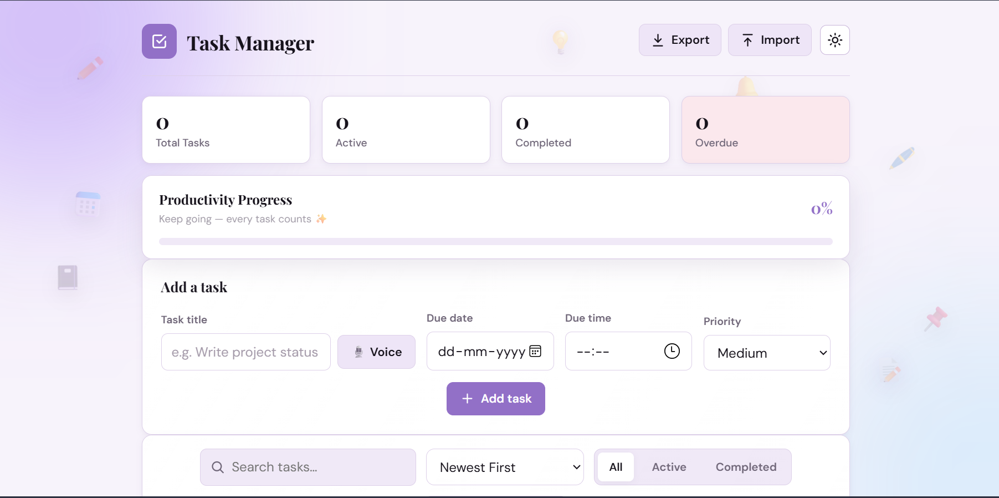
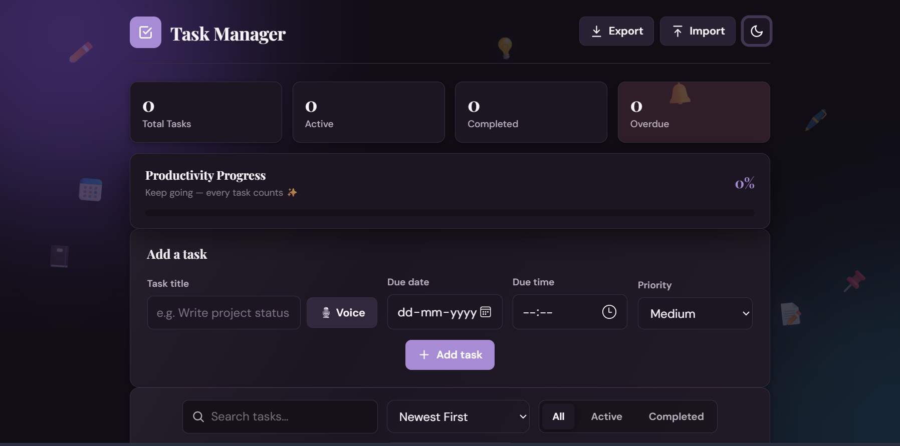
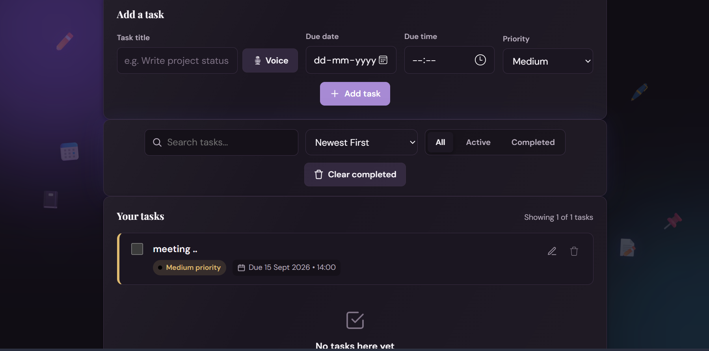
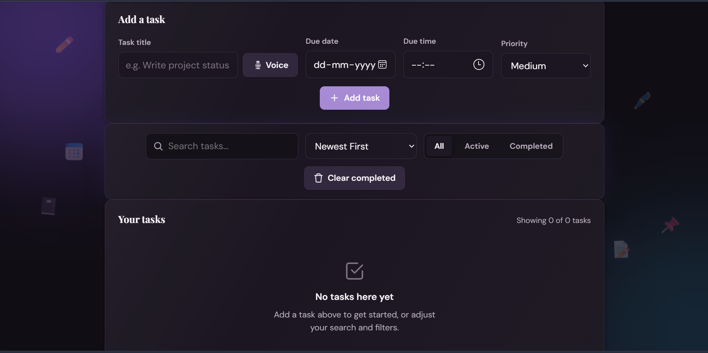
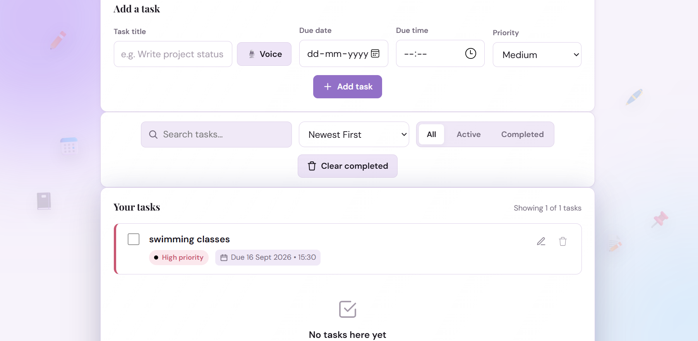

# Personal Task Manager

A responsive and interactive task management web application designed to help users organize, prioritize, and track their daily tasks efficiently.

## 🚀 Live Demo

[View Live Project](https://06style.github.io/Personal-Task-Manager/)

## 📸 Screenshots

### Light Theme


### Dark Theme


### Task Management


### Task Added


### Responsive View


## ✨ Features

- Add new tasks with priority and due date/time
- Edit existing tasks
- Mark tasks as completed or active
- Delete tasks
- Search tasks instantly
- Filter tasks by status
- Sort tasks by creation date, priority, and due date
- Drag and drop tasks to manually reorder them
- Persistent task data using Local Storage
- Export tasks as a JSON backup
- Import previously exported tasks
- Clear all completed tasks
- Automatic overdue task detection
- Task statistics and completion percentage
- Light/Dark theme toggle with theme persistence
- Keyboard shortcuts for faster task management
- Voice-based task creation using browser speech recognition
- Form validation and error handling
- Dynamic UI updates without page reload
- Responsive design for desktop, tablet, and mobile devices
- Smooth animations and visual feedback

## 🛠️ Technologies Used

- HTML5
- CSS3
- JavaScript (ES6+)
- DOM Manipulation
- Web Speech API
- Local Storage API
- Git
- GitHub
- GitHub Pages

## 📂 Project Structure

```text
Personal-Task-Manager/
│
├── css/
│   ├── style.css
│   └── theme.css
│
├── js/
│   ├── app.js
│   ├── storage.js
│   ├── ui.js
│   └── utils.js
│
├── screenshots/
│   ├── dark.png
│   ├── darkk.png
│   ├── darrkk.png
│   ├── ligghht.png
│   └── light-theme.png
│
├── index.html
├── README.md
└── .gitignore